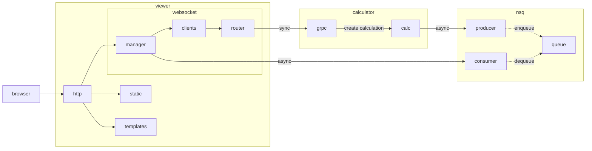
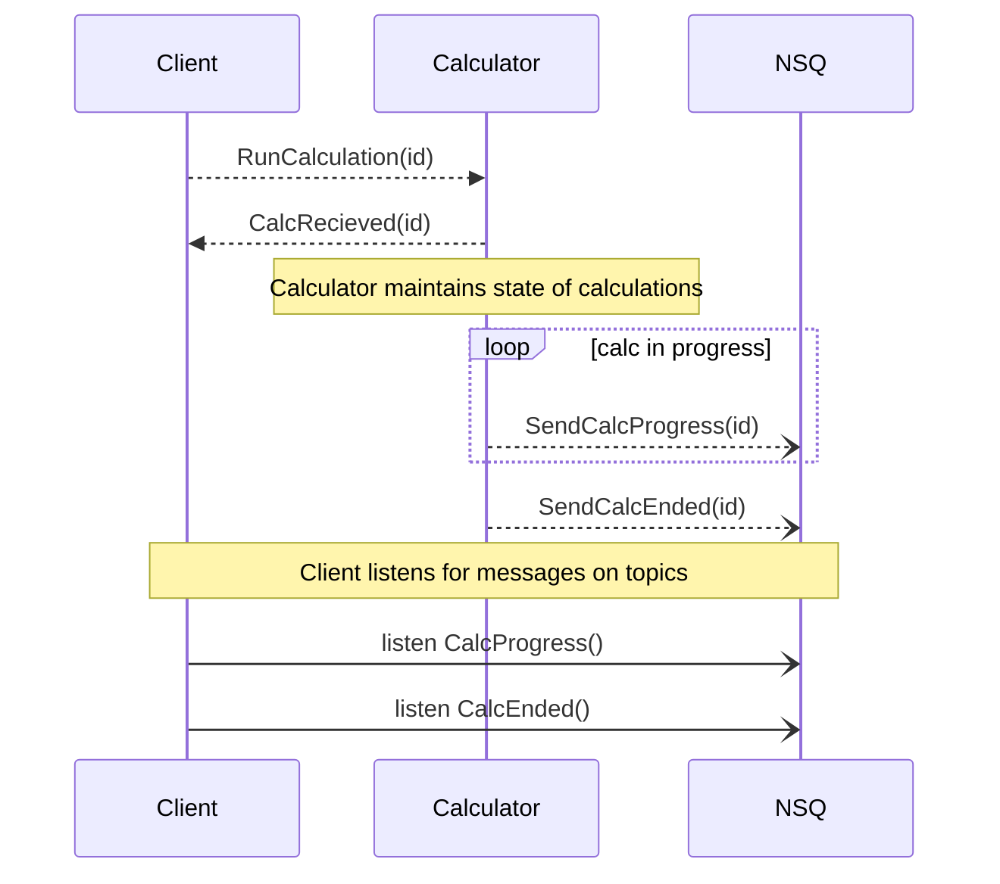
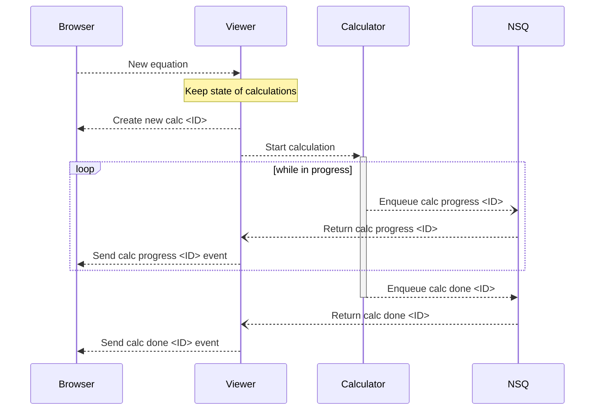

# Microservice Madness
Microservice based playground with an equation-calculator theme. **This project does nothing and is not used for anyting other than learning.**

## So what is it?
- `server` is a service that exposes a GRPC API to solve an equation.
- `cli` is a tool to call this API to solve some equations.
- `shared/queue` is a NSQ(New Simple Queue) queue implemented as a shared Go module

The protos are placed outside the project to simulate a realistic setup.

## Usage
Make a query against the running server using grpcurl
```
grpcurl -plaintext -d '{"equation":"1+1"}' localhost:8000 calculator.CalculationService/Run
```

List all grpc end points using grpcurl
```
grpcurl --plaintext localhost:8000 list
```

### Debugging / running locally
- Setting broadcast address of nsqd in docker compose to be able to run clients stand alone next to
docker compose orchestration. See: https://github.com/nsqio/go-nsq/issues/69
```
command: /nsqd --lookupd-tcp-address=nsqlookupd:4160 #--broadcast-address=127.0.0.1 #example for debugging locally
```

# Details
Here you'll find drawings and models in details.

## Overall system architecture
Component diagram showing the essential modules and their general interaction.


## Interaction between calculator and nsq
Sequence diagram showing message flow between the calculator and the queue when calculations are created
Most noteworthy is that the calculator takes requests on a GRPC endpoint but returns results asynchronously over nsq.


## Creating a new calculation in the viewer
Sequence diagram of how the web viewer interacts with the backend when a new calculation is created.
