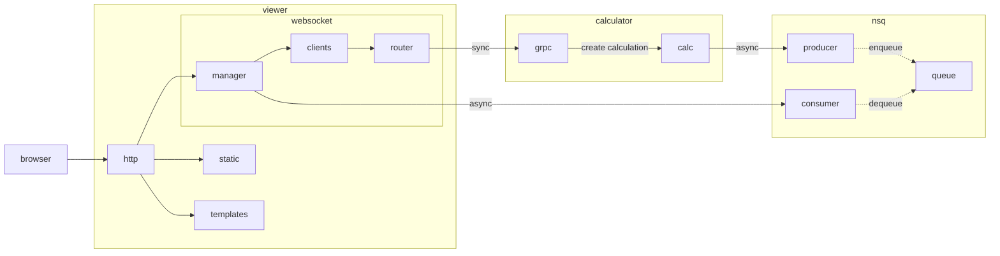
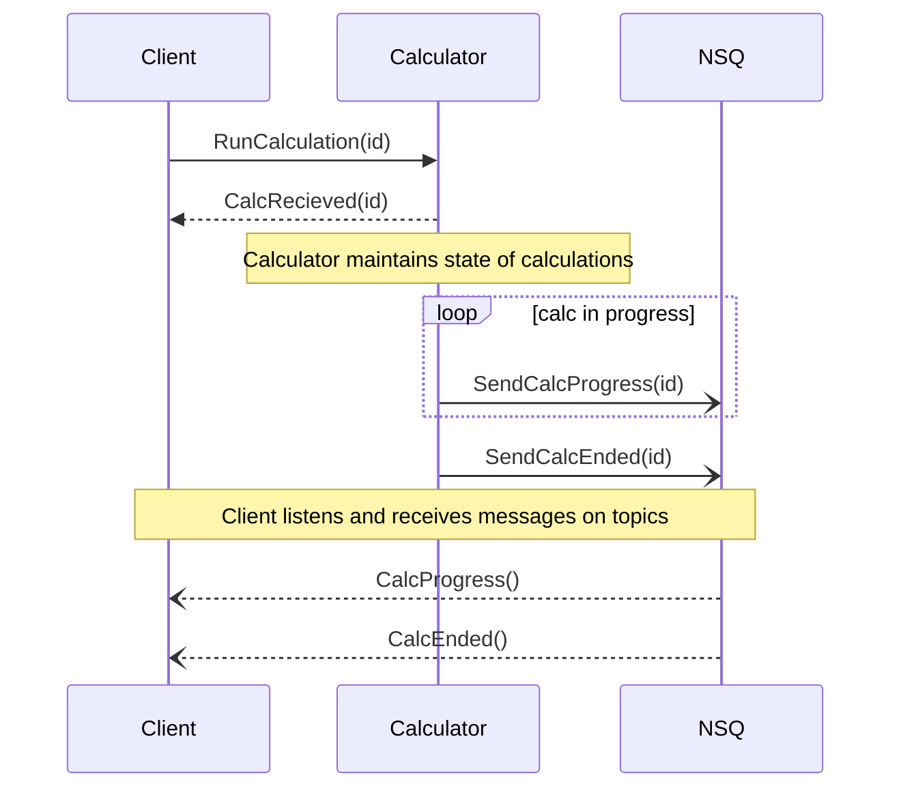
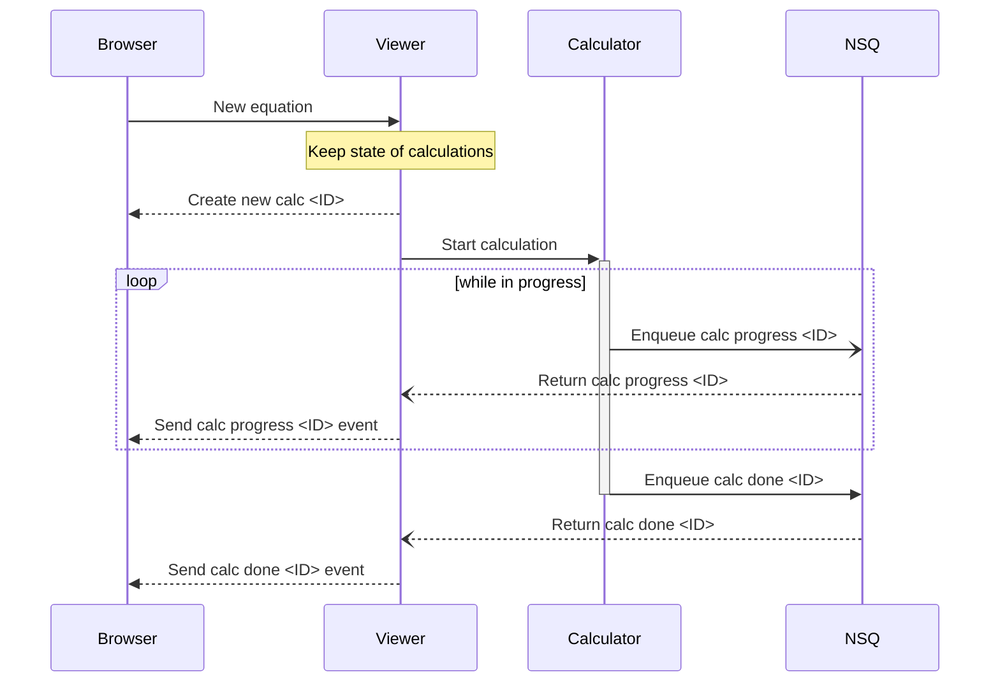
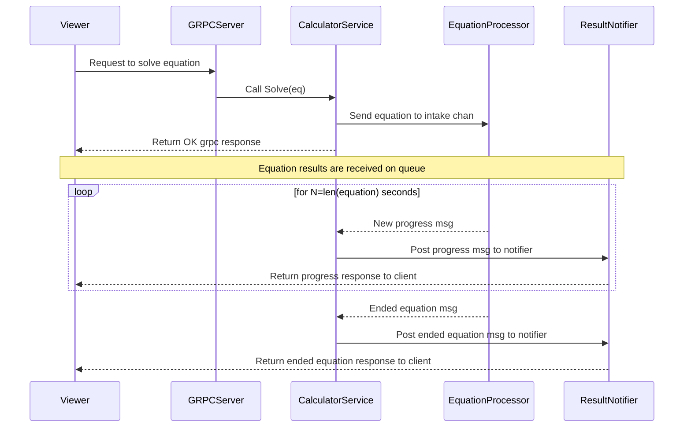

# Calculator Madness
Microservice playground with a calculator theme.
**This project does nothing and is not used for anyting other than learning.**

https://github.com/mortenskoett/calculator-madness/assets/17837870/8c066d91-523f-4b28-8727-fbf2b9fda362

## So what is it?
This is a small application that takes text input (an equation) and spends an inordinate amount of time counting how many chars the equation consists of. The complexity lies in the backend which has a microservice-based architecture that facilitates async message handling between `calculator` and `viewer`.
Each connected client (browser) is connected using websocket making it possible to receive continous progress messages in the UI.

The system consists of the following components:
1. `viewer` is the front facing UI server which establishes websocket connections to the clients, does GRPC calls to the `calculator` and receives results and progress messages over `nsq`. Because a single `viewer` instance might serve multiple websocket connections, it is necessary to pass along a connection id through the backend calls.
2. `nsq` is an instance of the NSQ(New Simple Queue) message queue implemented as a shared Go module. It contains a producer and a consumer that is reused across services. The consumer is generic on the message interface type. Due to the uniqueness of each websocket connection, a unique topic and consumer is used per `viewer` instance.
3. `calculator` is the core business logic which amounts to `return len(equation)`. However, the service features a GRPC interface and will publish equation processing results to `nsq`.

## Usage
### Run all services in docker
```
make build run
```

### Make a query against the calculator
```
grpcurl -plaintext -d '{"client_id":"<cid>", "equation":{"id":"<eid>", "value":"1+1"}, "result_topic":"<topic>"}' localhost:8000 calculator.CalculationService/Run
```

### List all grpc endpoints of the calculator
```
grpcurl --plaintext localhost:8000 list
```

### Debugging lookupd / running locally
- If using nsqlookupd it can be necessary to set broadcast address of nsqd to be able to run nsq in docker next to other services running on the host e.g. for debugging. See: https://github.com/nsqio/go-nsq/issues/69

```
command: /nsqd --lookupd-tcp-address=nsqlookupd:4160 #--broadcast-address=127.0.0.1 #example for debugging locally
```

# Details
## Overall system architecture
Component diagram showing the essential modules and their general interaction.


## Interaction between calculator and nsq
Sequence diagram showing interaction between `calculator` and `nsq` when calculations are created. The `calculator` service takes requests on a GRPC endpoint but returns results asynchronously over nsq.


## Creating a new calculation in the viewer
Sequence diagram of how `viewer` interacts with the backend when a new calculation is created.


## Handling calculation progress and results concurrently
Sequence diagram showing the interaction of the concurrent handling of equations in the CalculatorService.

