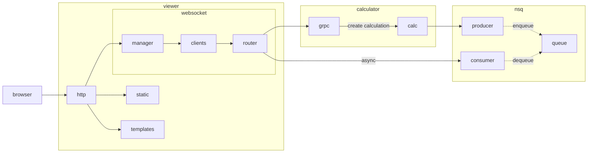

# Microservice Madness
Microservice based playground with an equation-calculator theme.

## What is this?
- `server` is a service that exposes a GRPC API to solve an equation.
- `cli` is a tool to call this API to solve some equations.
- `shared/queue` is a NSQ queue implemented as a shared Go module

The protos are placed outside the project to simulate a realistic setup.

## Usage
Make a query against the running server using grpcurl
```
grpcurl -plaintext -d '{"equation":"1+1"}' localhost:8000 calculator.CalculationService/Run
```

List all grpc end points using grpcurl
```
grpcurl --plaintext localhost:8000 list
```

### Debugging / running locally
- Setting broadcast address of nsqd in docker compose to be able to run clients stand alone next to
docker compose orchestration. See: https://github.com/nsqio/go-nsq/issues/69
```
command: /nsqd --lookupd-tcp-address=nsqlookupd:4160 #--broadcast-address=127.0.0.1 #example for debugging locally
```

# Details
Here you'll find drawings and models in details.

### Component graph of system architecture



### Sequence diagram of creating a new calculation
How the web viewer interacts with the backend when a new calculation is created.
