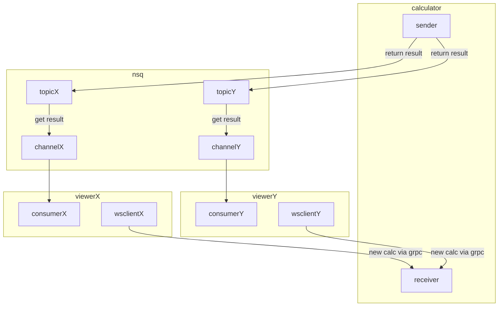

# Rethinking how to use NSQ

## How the NSQ Go lib works
- a consumer subscribes to a channel and the channel recieves from a single topic
- if multiple consumers use same channel, only one of the consumers will recieve a sent message (concurrency pattern)
- we set a single handler to recieve messages for a single consumer

## Ideas
- we want the ability to add multiple handlers to a consumer
    or alternatively use multiple consumers on multiple topics -- if we do this then we could potentially deal with the channels issue by handling that inside the consumer type

- we want the usage to be typed
    changes to types and handlers etc go in the shared queue module

- we want a consumer to always receive an answer on its channel
    we cant have multiple consumers on same channel -- consider what happens if we scale the viewer horizontally, then a viewer might not receive a message

## What is the simplest solution?
1. extend the consumer type so that foreach msg recieved on the set topic, it will pass the message on to the correct handler. Then another ctor could made to make it possible (and obvious) to create a UniqueConsumer with the behaviour that messages cannot be split over multiple channels.

2. send msgs on different topics and create consumers for each topic or make CreateConsumer[T MessageType] so that a consumers is generic on the return type and the channel is unique.
   1. This will guarantee that the consumer contained in the viewer instance will always resceive the same messages.
   2. It will then be necessary to instantiate a consumer for each topic.

3. Unique channel consumers + statically type.
   1. When a consumer is created:
      - unique channel, unique topic will ensure messages go only to relevant consumer

